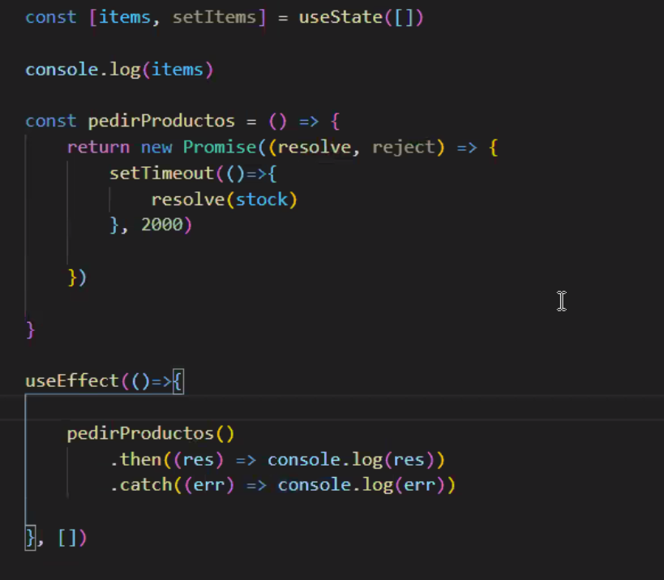

* react-icons
https://react-icons.github.io/react-icons/

* Snippet de componente
rafc

# Hooks

> import React, {useState} from 'react'

useState retorna un array con 2 objetos.
> const [state, setState] = useState();

```Javascript

export const Clock = () => {
    const [time, setTime]= useState(new Date());
    
    const updateTime = () =>{
        setTime(new Date());
    }

    return(
        <div onClick={updateTime}></div>
        <h3>{time.toLocaleString()}</h3>
    )

}
```

No usar funciones asincronas en un componente porque no funcionan correctamente. En este caso se puede usar el hook useeffects()

```Javascript

export const Clock = () => {
    const [time, setTime]= useState(new Date());
    
    const updateTime = () =>{
        setTime(new Date());
    }

    // useEffect(function, arrayDependecies)
     useEffect(() => {
         setTimeOut(() => setTime(new Date()),1000)
     }, [time])

    return(
        <h3>{time.toLocaleString()}</h3>
    )

}
```



